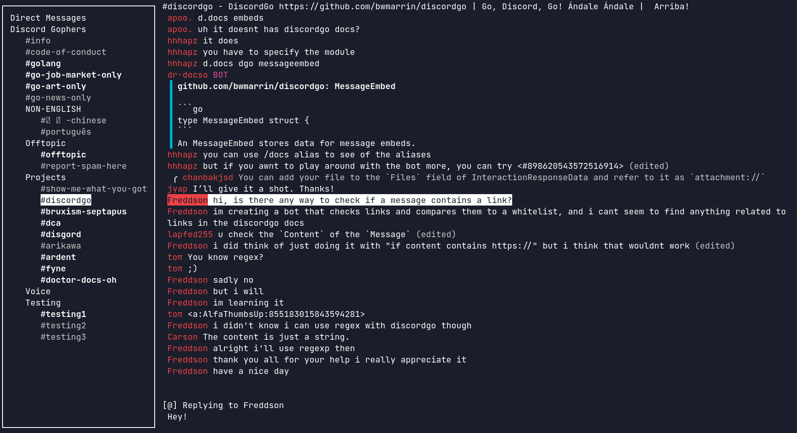

# Discordo &middot; [](https://discord.com/invite/VzF9UFn2aB) [](https://github.com/ayn2op/discordo/actions/workflows/ci.yml) [](https://goreportcard.com/report/github.com/ayn2op/discordo) [](https://github.com/ayn2op/discordo/blob/master/LICENSE)

Discordo is a lightweight, secure, and feature-rich Discord terminal client. Heavily work-in-progress, expect breaking changes.



- Lightweight
- Secure
- Configurable
- Cross-platform
- Minimalistic
- Feature-rich
  - Mouse & clipboard support
  - 2-Factor authentication
  - [Discord-flavored markdown](https://support.discord.com/hc/en-us/articles/210298617-Markdown-Text-101-Chat-Formatting-Bold-Italic-Underline-)

## Installation

### Prebuilt binaries

You can download and install a [prebuilt binary here](https://nightly.link/ayn2op/discordo/workflows/ci/main) for Windows, macOS, or Linux.

### Package managers

- Arch Linux: `yay -S discordo-git`
- FreeBSD: `pkg install discordo` or via the ports system `make -C /usr/ports/net-im/discordo install clean`.
- NixOS: `nix-shell -p discordo`

- Windows (Scoop):

```sh
scoop bucket add ingenarel https://github.com/ingenarel/ingenarel-scoop-bucket
scoop install discordo-git
```

### Building from source

```bash
git clone https://github.com/ayn2op/discordo
cd discordo
go build .
```

### Linux clipboard support

- `xclip` or `xsel` for X11 (`apt install xclip`)
- `wl-clipboard` for Wayland (`apt install wl-clipboard`)

## Usage

1. Run the `discordo` executable with no arguments.

> If you are logging in using an authentication token, provide the `token` command-line flag to the executable (eg: `--token "OTI2MDU5NTQxNDE2Nzc5ODA2.Yc2KKA.2iZ-5JxgxG-9Ub8GHzBSn-NJjNg"`). The token is stored securely in the default OS-specific keyring.

2. Enter your email and password and click on the "Login" button to continue.

## Configuration

The configuration file allows you to configure and customize the behavior, keybindings, and theme of the application.

- Unix: `$XDG_CONFIG_HOME/discordo/config.toml` or `$HOME/.config/discordo/config.toml`
- Darwin: `$HOME/Library/Application Support/discordo/config.toml`
- Windows: `%AppData%/discordo/config.toml`

[The default configuration can be found here](./internal/config/config.go).


## FAQ

### Manually adding token to keyring

Do this if you get the error:
>failed to get token from keyring: secret not found in keyring

1. First, start the keyring daemon
```bash
eval $(gnome-keyring-daemon --start)
export $(gnome-keyring-daemon --start)
```

2. Create a keyring using `seahorse` application if a keyring doesn't already exist.
   
3. Add the token secret using
```bash
secret-tool store --label="Discord Token" service discordo username token
```

4. When it prompts for the password, paste your token, and that's it!


## Disclaimer

Automated user accounts or "self-bots" are against Discord's Terms of Service. I am not responsible for any loss caused by using "self-bots" or Discordo.
