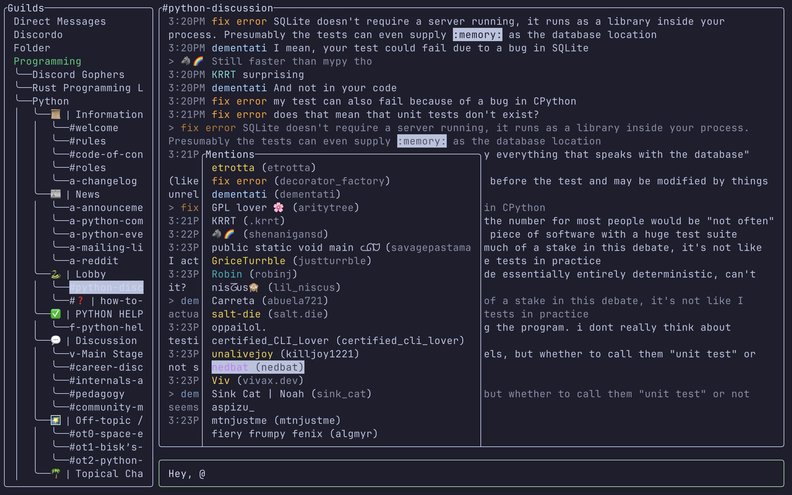

# Discordo &middot; [](https://discord.com/invite/VzF9UFn2aB) [](https://github.com/ayn2op/discordo/actions/workflows/ci.yml) [](https://goreportcard.com/report/github.com/ayn2op/discordo) [](https://github.com/ayn2op/discordo/blob/master/LICENSE)

Discordo is a lightweight, secure, and feature-rich Discord terminal client. Heavily work-in-progress, expect breaking changes.



## Features

- Lightweight
- Configurable
- Mouse & clipboard support
- Attachments
- Notifications
- Typing Indicators
- Message History
- 2-Factor & QR code authentication
- Discord-flavored markdown

## Installation

### Prebuilt binaries

You can download and install a [prebuilt binary here](https://nightly.link/ayn2op/discordo/workflows/ci/main) for Windows, macOS, or Linux.

### Package managers

- Arch Linux: `yay -S discordo-git`
- Gentoo (available on the guru repos as a live ebuild): `emerge net-im/discordo`
- FreeBSD: `pkg install discordo` or via the ports system `make -C /usr/ports/net-im/discordo install clean`.
- Nix: Add `pkgs.discordo` to `environment.systemPackages` or `home.packages`.

- Windows (Scoop):

```sh
scoop bucket add vvxrtues https://github.com/vvirtues/bucket
scoop install discordo
```

### Building from source

```bash
git clone https://github.com/ayn2op/discordo
cd discordo
go build .
```

### Wayland clipboard support

`wl-clipboard` is required for clipboard support.

## Usage

### Token (UI, recommended)

1. Run the `discordo` executable with no arguments.

2. Enter your token and click on the "Login" button to save it.

### Token (environment variable)

Set the value of the `DISCORDO_TOKEN` environment variable to the authentication token to log in with.

```sh
DISCORDO_TOKEN="OTI2MDU5NTQxNDE2Nzc5ODA2.Yc2KKA.2iZ-5JxgxG-9Ub8GHzBSn-NJjNg" discordo
```

### QR (UI)

1. Run the `discordo` executable with no arguments.

2. Click on the "Login with QR" button.

3. Follow the instructions in the QR Login screen.

## Configuration

The configuration file allows you to configure and customize the behavior, keybindings, and theme of the application.

- Unix: `$XDG_CONFIG_HOME/discordo/config.toml` or `$HOME/.config/discordo/config.toml`
- Darwin: `$HOME/Library/Application Support/discordo/config.toml`
- Windows: `%AppData%/discordo/config.toml`

Discordo uses the default configuration if a configuration file is not found in the aforementioned path; however, the default configuration file is not written to the path. [The default configuration can be found here](./internal/config/config.toml).

> [!IMPORTANT]
> Automated user accounts or "self-bots" are against Discord's Terms of Service. I am not responsible for any loss caused by using "self-bots" or Discordo.
