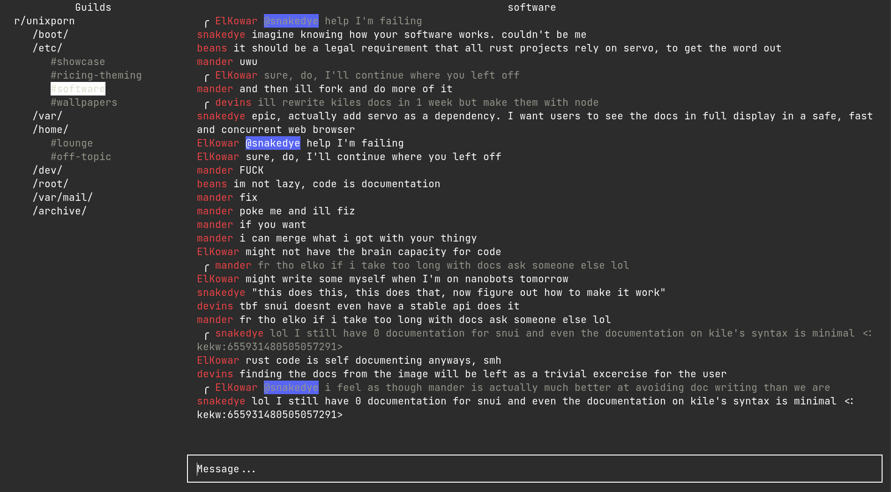

# discordo

[WIP] Lightweight Discord terminal client



## Features

- **Lightweight**: Designed to have a low memory footprint and low CPU usage, overall a low usage of system resources.
- **Secure**: Securely stores the authentication token on first login in an OS-specific keyring file.

## Installation

### Building from Source

- Run the following commands in chronological order.

```
git clone https://github.com/rigormorrtiss/discordo
cd discordo && go build
```

## Usage

- Run the built executable in a new Terminal.
- Choose the preferred login method.
- Log in using the chosen login method and click on "Login" button to continue.
Note: bot accounts must be prefixed with "Bot ".

## Disclaimer

Automated user accounts or "self-bots" are against Discord's Terms of Service. I am not responsible for any loss caused by using "self-bots" or Discordo.
